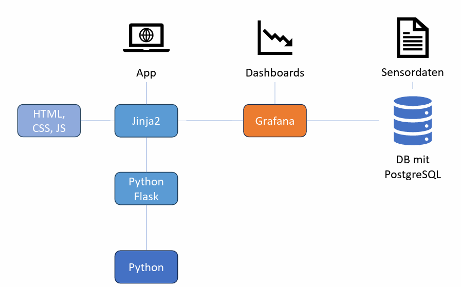

# BambergEcoPulse


In dieser Arbeit soll es darum gehen, den Bürgerinnen und Bürgern der Stadt Bamberg die Möglichkeit zu bieten, die Sensordaten des Klimamessnetzvereins Bamberg (BVM) einzusehen und durch die Funktion des Hinzufügens von Annotationen zu diesen, den Crowdsensing-Aspekt näher zu bringen. Dadurch ergeben sich die Leitfragen, inwieweit sich dies auf die Entwicklung eines solchen Tools auswirkt, inwiefern ein Ansatz wie dieser sinnvoll ist und in der Zukunft berücksichtigt werden sollte.

## Architecture



## Prerequisites

You will need Docker installed on your machine, check [here](https://www.docker.com/get-started/).

## Setup

First run...
```
cd /app
```

...then...
```
docker compose up
```
...enjoy!

## Stakeholder

- [Bürgerverein Bamberg Mitte e.V. (BVM)](https://bvm-bamberg.de/de/home/)
- [Domänenexpert*innen (Mikrometeorologe der Universität Bayreuth)](https://www.micrometeorology.de/)
- [Lehrstuhl für Informatik, insbesondere Mobile Softwaresysteme/Mobilität der Otto-Friedrich-Universität Bamberg](https://www.uni-bamberg.de/mobi/)

## Anforderungen

tba.

## Problem Area

- connect Grafana iframe to Flask application
- make application deployable on all machines without needing to setup data every single time
- get station data automatically
- ...

## Solution Area

- ...